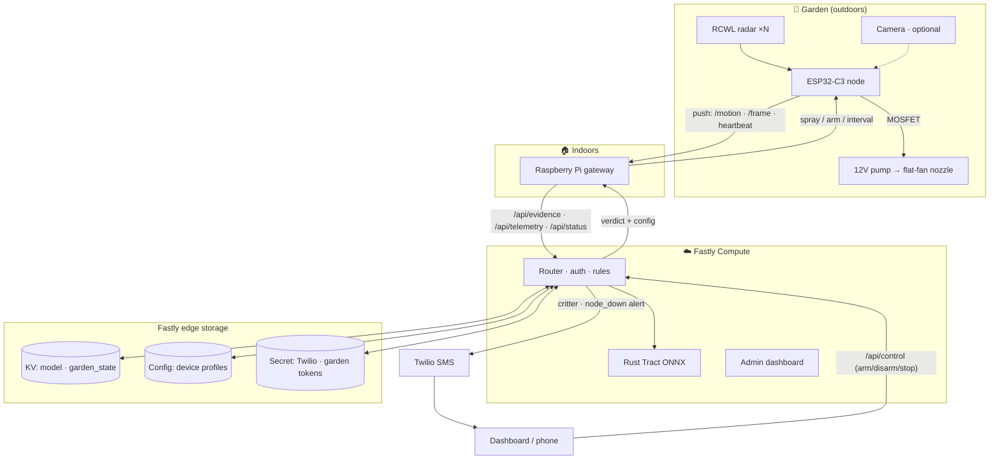

# Fastly Garden Protector: Edge-Native IoT Architecture

System architecture, hardware state loop, and data flow for the Fastly Garden Protector — a
real-time, edge-native IoT application that uses **Fastly Compute** to protect gardens from
critters. For the physical build see [hardware-architecture.md](hardware-architecture.md); the
authoritative request/response shapes for every endpoint live in
[endpoint-contract.md](endpoint-contract.md).

---

## System overview

Three actors:

* **ESP32-C3 garden node** (at the 12 V enclosure): microwave radar triggers a bounded
  water-jet burst; pushes events + heartbeats to the Pi. Cameras are optional.
* **Raspberry Pi — indoor gateway:** ingests the node's pushes, forwards incident evidence to
  the edge, tracks liveness, archives time-lapse. It never streams from the garden.
* **Fastly Compute** (serverless edge / WebAssembly): classification, the spray decision,
  the admin dashboard, and outbound alerts — backed by KV / Config / Secret stores.



---

## Incident sequence

One bounded incident, end to end. (Phase 1 is radar-only — no frame, no edge classification;
the camera steps apply only once an optional on-box camera is fitted, Phase 2.)

```mermaid
sequenceDiagram
    autonumber
    participant Rad as Radar (RCWL)
    participant Node as ESP32-C3 node (garden)
    participant Pi as Raspberry Pi (indoors)
    participant Edge as Fastly Compute
    participant Store as KV / Config / Secret
    participant SMS as Twilio

    Note over Node: Wi-Fi associated · pump off · line depressurized
    Rad->>Node: Motion (GPIO interrupt, bed id)
    Note over Node: Incident — capture ≤ 1 / 5 s only if a camera is fitted
    Node->>Pi: POST /motion { bed, batt_v, jpeg? } (held open, 3 s timeout)
    Pi->>Edge: POST /api/evidence (signed; jpeg if present)
    Edge->>Store: verify garden token · read config · (Phase 2) load model
    Edge->>Edge: rain veto · (Phase 2) human-veto + species best-guess (Tract ONNX)
    par log
        Edge->>Store: PUT event (metadata + jpeg) → garden_state / archive
    and alert
        Edge->>SMS: critter / node_down deep link (best-effort, 1.5 s cap)
    end
    Edge-->>Pi: 200 { action, species?, confidence?, reason? }
    Pi->>Pi: apply arm / override (garden_state KV)
    alt armed AND not vetoed
        Pi-->>Node: 200 { spray:true, seconds:3 }
        Note over Node: MOSFET → pump on (~1–2 s prime → jet); hard cap = min(seconds, 4 s)
    else vetoed · disarmed · STOP
        Pi-->>Node: 200 { spray:false }
    end
    Note over Node: timeout / no reply → no spray (fail-closed) · post-spray refractory
```

**Fail-closed, three independent layers** (mirrors the hardware
[three-layer model](hardware-architecture.md)): an unreachable Pi/edge or a dropped reply
means the node never receives `spray:true`, so it does nothing; on any power loss the **pump is
unpowered → no flow** (its check valve blocks siphon); and even a `spray:true` is bounded by
the node's **local burst cap (2–4 s)**, so a crash mid-burst self-terminates the spray.

---

## Liveness & dashboard health

A node that fails *closed* (no spray) is indistinguishable from a quiet garden — so loss of
protection is silent unless monitored. Two heartbeat tiers feed the Compute-served admin
dashboard:

* **Node → Pi (~60 s).** Doubles as liveness; the Pi marks the node **DOWN** after ~3 misses
  and writes node health (online, last-seen, battery) to the **`garden_state` KV store**.
  `GET /api/state` surfaces it as a node-status tile.
* **Pi → Fastly (`POST /api/telemetry`).** The Pi reports its own + the node's health and
  environment readings to the edge, which stamps an edge-receipt `last_seen_ms` and persists
  the blob per-device. `GET /api/state` then derives ONLINE/OFFLINE (DOWN after ~150 s of
  silence) so a dead **gateway** is visible too. See [endpoint-contract.md](endpoint-contract.md).
* **Alerting.** A DOWN transition fires an SMS via the **edge → Twilio** path (`node_down`
  event), keeping credentials at the edge. The same config channel carries a **maintenance
  "don't spray"** flag (applied on the next heartbeat) so the jet can be muted while gardening.

---

## Decision logic (presumption of critter)

Radar firing already establishes that *something with moving mass is in the bed*, so the edge
doesn't need to positively identify a raccoon vs. a rabbit to act. It treats **critter as the
default and looks for a reason to withhold.** The ML stage (Phase 2, when a camera is fitted)
runs two jobs:

1. **Veto check (gates the spray):** is there a **human** in frame — and, optionally, a known
   pet or a confidently empty/foliage-only ("wind") scene? Human detection is far more robust
   than fine-grained critter ID, so we gate on the *reliable* signal.
2. **Species best-guess (logged, not gating):** the critter classification still runs and is
   recorded for telemetry/dashboard, but it never blocks a spray.

So **`spray = armed AND radar-tripped AND not vetoed`**. This fails *aggressively* toward
deterrence (better to soak an unidentifiable critter than miss it) while failing *safe* for the
one case that matters — never spraying a person. The `/api/evidence` response carries `action`
(+ a `reason` when a detection was withheld) alongside the logged `species`/`confidence`.

**Rain suppression (environmental veto):** if the **rain sensor** reports active rain, the
spray is suppressed — critters shelter during rain, so there's nothing to deter and the water
is wasted. This is a **comfort optimization, not a safety gate**, and is fail-safe by
construction: it can only ever *withhold* a spray, never trigger one. The **authoritative, fast
path is local on the node** (it owns the rain gauge, so it suppresses with zero network
dependency); the edge mirrors it as a backstop — `/api/evidence` reads the node's freshest
telemetry and, when `raining` is true (and fresh), downgrades a `mitigate` to `none` with
`reason:"rain"` so the dashboard shows *why* nothing fired. Stale or absent telemetry → no veto
(worst case: a harmless spray in the rain).

**Daytime is where benign triggers cluster** — you in the bed (gardening) *and* your **normal
irrigation sprinklers** running (moving water is "moving mass" the radar sees). The human veto
covers the first; the second is best handled by a **scheduled irrigation-suppression window** in
config (mute during known watering times) rather than asking vision to recognize spray.
Separately — day or night — the node applies a **post-spray refractory**: it ignores radar
during and for a few seconds after its own burst, so the jet's own spray can't re-trigger it
into a loop.

**Night:** by default we **presume raccoon and spray on radar** (they're nocturnal, so that's
when deterrence matters most; a person would only get a harmless soak, and Disarm / maintenance
mode is available), capturing/classifying best-effort for the log. With the **optional IR
floodlight + NoIR camera** ([hardware-reference.md §2](hardware-reference.md),
[hardware-architecture.md §8](hardware-architecture.md)) the node **pulses IR for the capture**,
so the **human veto works after dark too**. (The IR-cut-filter caveat — you need a NoIR module —
is in the hardware plan.)

---

## Fastly platform component mapping

| Fastly Product | Generic Capability | Garden Protector Role |
| :--- | :--- | :--- |
| **Fastly Compute** | Serverless edge computing | Runs the API gateway, verifies the per-garden token, loads the ML model, executes the decision rules, and dispatches outbound alerts. |
| **KV Store** | Edge key-value database | ML model weights (`garden_models`) + the writable `garden_state` (arm/override flags, latest event JSON + JPEG, node health). |
| **Config Store** | Edge configuration store | Device profiles, capture interval, and the irrigation-suppression window. |
| **Secret Store** | Edge secrets management | Twilio API token and per-garden auth tokens (`X-Garden-Auth`). |

---

## Fail-safe & timeout tuning

Strict **fail-closed** principles and aggressive timeouts keep a network dropout or a software
hang from becoming a runaway spray.

* **Node burst cap (the hardware watchdog):** the deterrent is a **bounded burst** the node
  self-terminates at **min(seconds, 4 s)** — enforced locally, so it holds even if the network
  drops mid-burst. Because the burst is bounded there is no continuous keep-alive loop to fail.
* **Node request timeout:** the node holds the `/motion` request open with a strict **3 s
  timeout**; on timeout or any non-`spray:true` reply it **does nothing** (fail-closed) and
  resumes its schedule.
* **Gateway spray core:** the Pi's spray decision is a pure fail-closed function — an unreadable
  `garden_state` store or a missing verdict yields **no spray**, never "keep firing."
* **Compute handler timeout:** edge handlers are tuned to terminate beyond **5 s** to keep the
  edge responsive.
* **Outbound (Twilio) timeout:** outbound SMS calls use a strict **1.5 s timeout**; a slow or
  unreachable gateway makes Compute **abort the SMS and return the verdict to the Pi
  immediately** — the physical reaction is never delayed by a text message.

---

## Data schemas

> **[endpoint-contract.md](endpoint-contract.md) is authoritative** for every live endpoint
> (`/api/evidence`, `/api/telemetry`, `/api/status`, `/api/state`, `/api/control`, and the
> node↔Pi `/motion` + `/frame`). The examples below are illustrative — defer to the contract
> where they differ.

**Evidence (`POST /api/evidence`)** — JPEG body (or `multipart/form-data`) plus telemetry:

```json
{
  "device_id": "garden-pi-01",
  "timestamp": 1782012034,
  "telemetry": {
    "battery_voltage": 4.12,
    "temperature_c": 18.5,
    "humidity_pct": 64.0,
    "rainfall_mm": 0.0,
    "raining": false,
    "lux_level": 12.0
  },
  "signature": "ab0923cd...ff89"
}
```

*(Optional telemetry fields — `soil_moisture_pct`, `reservoir_ok`, `spray_confirmed`,
`presence_distance_cm`, `on_backup_power` — are sent only when the matching peripheral is
fitted; the edge stores any JSON verbatim, so adding a sensor needs no contract change.)*

**Verdict (Fastly → Pi):**

```json
{
  "action": "mitigate",
  "species": "raccoon",
  "confidence": 0.941,
  "reason": null
}
```

`action` is `mitigate` or `none`; `reason` is set when a spray was withheld (e.g. `"rain"`,
`"human"`, `"disarmed"`). Arm/Disarm/Stop/Resume are issued from the dashboard via
`POST /api/control` and read back by the Pi on its `GET /api/status` heartbeat.
