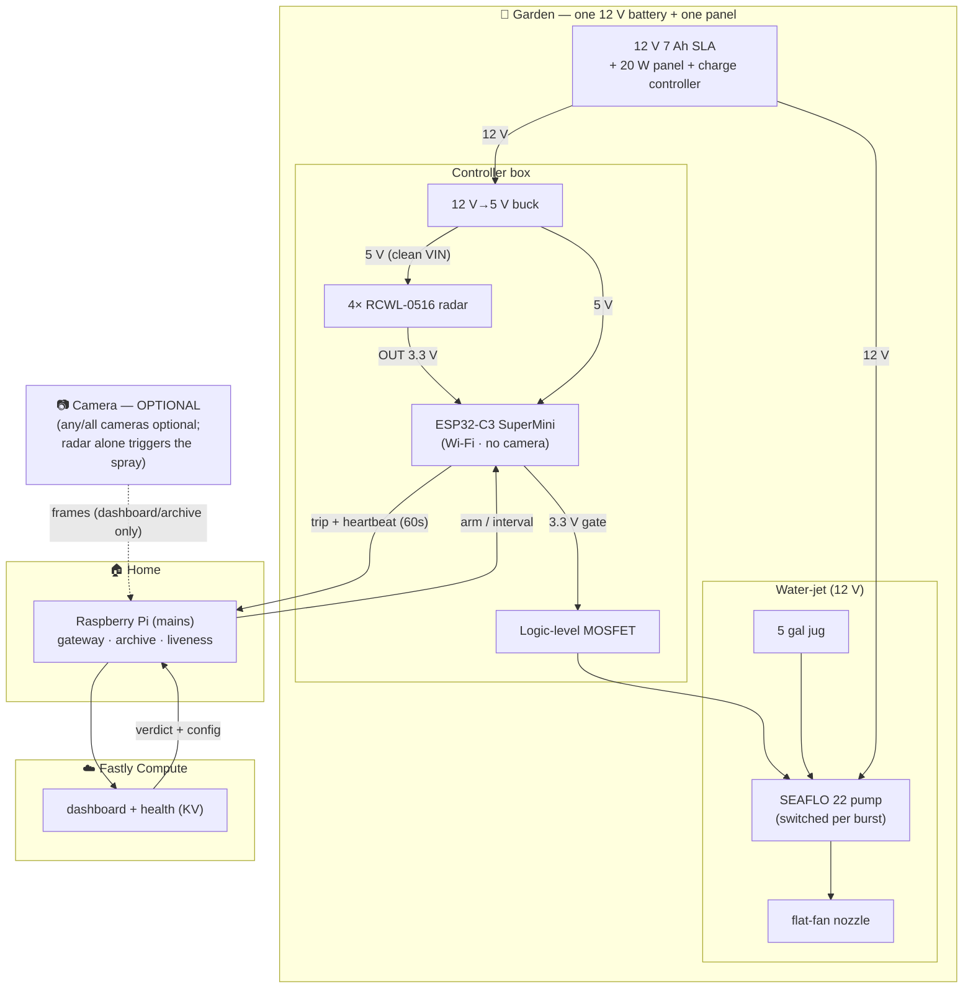

# 🌱 Fastly Garden Protector — Hardware Build

The single source of truth for the physical garden deployment: what to build, how it's wired,
and what to buy. Edge/software request flows live in [architecture.md](architecture.md);
Pi-side HAL notes and weatherproofing live in [hardware-reference.md](hardware-reference.md).

---

## 1. The build at a glance

* **Raspberry Pi — indoors** (mains + home Wi-Fi), the gateway: ingests pushes from the
  garden, forwards incident frames to **Fastly Compute**, tracks liveness, archives time-lapse.
* **ESP32-C3 SuperMini — the garden brain** at the enclosure: reads the radars, drives the
  pump, heartbeats the Pi. Low power, USB-C flashing, plenty of GPIO.
* **4× RCWL-0516 microwave radar** — the trigger (one per bed + spares).
* **Water-jet (12 V):** 5 gal jug → SEAFLO diaphragm pump → flat-fan nozzle. The MOSFET
  switches the **pump** directly — **no solenoid**.
* **One 12 V battery + one small solar panel** powers the whole garden box.
* **Cameras are optional — none required.** Radar alone triggers the spray; a camera only adds
  viewing/time-lapse and (later) an ML human-veto.

**Radar → spray is the complete deterrent.** A camera never gates the spray; the
radar → decide → pump core runs with zero cameras.

---

## 2. Rollout phases

* **Phase 1 — radar-only.** Radar trip → bounded burst, no camera, no edge round-trip. A
  working deterrent on day one that validates the full sense → spray chain and the fail-closed
  burst cap. *Radar can't tell a raccoon from you, so Phase 1 will soak you while weeding —
  disarm from the dashboard while you garden. The radar itself is harmless (low-power
  microwave, well under safety limits); the only risk is a nuisance spray.*
* **Phase 2 — camera veto (optional, later).** Add a low-power **on-box** camera
  (ESP32-CAM / XIAO-class); on a radar trip the board grabs one frame and Fastly checks it.
  Logic is **inverted: presume a critter and spray *unless* the edge spots a human/benign scene
  and vetoes.** Proving "human" is far more reliable than positively ID-ing a raccoon, and it
  fails safe for the only case that matters. A dead or absent camera falls back to radar-only.
  Species ID still runs, just for logging — see [architecture.md](architecture.md)
  *Decision logic*.

**Cameras, if fitted, take stills only — never a stream:** a user-configurable **time-lapse**
(1 m / 5 m / 15 m / 1 h …) for garden history, and **incident** frames capped at **≤ 1 / 5 s**
during an active incident for classification. At night we **presume raccoon and spray on
radar** (they're nocturnal); an optional **IR floodlight + NoIR camera** (§8) lets the human
veto work after dark.

---

## 3. Topology

---

## 4. Power — one 12 V domain

A single 12 V battery feeds the pump directly and the controller via a buck. Solar fits in a
small box because the pump, though it surges hard, runs only in short bursts:

* The pump draws ~5 A / ~60 W but **only for 2–4 s per spray** → **≈ 0.1 Wh per spray**; even
  50 sprays/day ≈ 5 Wh.
* C3 + 4 radars running 24/7 ≈ **5–10 Wh/day**.
* **Total ≈ 10–20 Wh/day.** The battery sources the 5 A surge; the panel only replaces ~15 Wh/day.

| Sizing | Choice |
| :--- | :--- |
| Panel | **One 10–20 W** panel harvests ~30–60 Wh/day — comfortable margin (no array). |
| Battery | **One 12 V 7 Ah SLA** (~84 Wh) holds **~4–8 days** with zero sun. |
| Battery-only fallback | No panel: ~1 week (7 Ah) / ~2 weeks (12 Ah), then recharge. Solar is the same footprint and removes the chore. |

**Rails:**

* **12 V 7 Ah SLA + 20 W panel + PWM charge controller** — the only power system.
* **12 V→5 V buck** (MP1584/LM2596) feeds the **C3's `5V` pin** *and* the **radar `VIN`**. The
  C3's `5V` pin is dead on battery (USB-only) and the RCWL-0516 wants ≥ 4 V, so the buck gives
  clean 5 V to both. Keep the 5 V branch decoupled (buck + caps) from the pump motor's noise.
* **Pump on 12 V**, switched low-side by the MOSFET. Common ground across the 12 V + 5 V sides.

---

## 5. Control flow & where the safety lives

**Incident:**
1. **Radar trips** → flags the C3 (it stays Wi-Fi-associated, so no slow reconnect).
2. **C3 → Pi:** `POST /motion {bed, batt_v}` (plus one still if an on-box camera is fitted),
   holding the request open for the verdict (~3 s timeout, no inbound server).
   *(Phase 1: spray locally and report the event best-effort — no frame, no wait.)*
3. **Pi → Fastly:** forwards to `POST /api/evidence`; Fastly applies the **rain veto** (and,
   in Phase 2, the **human-veto** + logged species guess) and returns
   `{action, reason?}`. See [endpoint-contract.md](endpoint-contract.md).
4. **Pi → C3:** the verdict returns as the HTTP response — `{spray, seconds}` where
   `spray = armed AND not vetoed` (plus current `arm`/`interval` config).
5. **C3 actuates:** on `spray`, assert the MOSFET → pump runs (~1–2 s prime, then jet);
   enforce a **hard local cap = min(seconds, 4 s)**.

A **~1–2 s priming lag** before water appears is accepted; **mount the jug above the pump**
(gravity-fed inlet) to keep it primed and the lag near-zero.

**Self-trigger + irrigation suppression.** The board applies a **post-spray refractory** — it
ignores radar during and for a few seconds after its own burst, so the jet's moving water
can't re-trigger it into a loop. A config **irrigation-suppression window** mutes it during
your normal daytime watering (also "moving mass" to the radar).

**Rain suppression.** If an optional rain sensor reports active rain, the spray is
**suppressed** (critters shelter in rain; no point wetting an already-wet bed). Fail-safe — it
only ever *withholds* a spray — enforced **locally on the node** and mirrored at the edge so
the dashboard shows *why* nothing fired (`reason:"rain"`).

**Safety model — fail-closed, three independent layers:**

| Layer | Mechanism | What it covers |
| :--- | :--- | :--- |
| Physics | **Pump unpowered = no flow** | Lose power / lose the board → pump stops → no water. The pump's internal check valve blocks gravity siphon when off. |
| Local watchdog | **C3 hard burst cap (2–4 s)** | Pi crash mid-burst / lost reply → spray self-terminates. |
| Policy | **Pi + Fastly veto** | Presumes critter once radar fires; withholds when the edge spots a human/benign scene (Phase 2) or rain. |

A **gate pulldown** keeps the MOSFET de-asserted (pump off) through boot/reset, so
software-"disarmed" = pump de-energized. The burst is bounded, so the spray needs no
keep-alive loop — Arm/Disarm/Stop policy flows Pi → board on the heartbeat (§7).

---

## 6. Wiring & C3 pin map

**Bench-test polarity first, water disconnected** (per the
[hardware-reference.md §1 polarity note](hardware-reference.md)) — getting the switch polarity
backwards floods the garden exactly when the system thinks it has failed safe.

* **Controller power:** 12 V SLA → **12 V→5 V buck** → C3 `5V` pin; the same 5 V feeds the
  **RCWL `VIN`**. Common ground with the 12 V side.
* **Switch — logic-level MOSFET** (3.3 V-native gate): C3 GPIO → gate, pump low-side to ground,
  **flyback diode across the pump motor**, **inline 5 A fuse** on 12 V+. **External gate
  pulldown** so it's de-asserted (no spray) through boot/reset.
* **Radar:** `VIN` ← 5 V, `OUT` (3.3 V logic) → C3 GPIO. Tune the RCWL trigger-time /
  sensitivity (`CDS` / `R-GN` pads) so wind-blown foliage doesn't fire it.
* **Optional IR floodlight:** 12 V flood low-side switched by a **2nd MOSFET** (C3 GPIO →
  gate), inline fuse; **pulse** it only for the night-capture window.
* **Optional I²C sensors:** on the shared SDA/SCL pins (3.3 V); **rain gauge** reed switch to a
  GPIO with internal pull-up (count tips, each ≈ 0.2–0.3 mm).

| C3 pin | Net |
| :--- | :--- |
| D0–D3 | 4× RCWL-0516 `OUT` (inputs) |
| D4 | Pump MOSFET gate (output, external pulldown) |
| D5 / D6 | *opt* — I²C SDA/SCL (**shared bus:** temp/humidity, light, RTC, INA219, OLED stack here) |
| D7 | *opt* — rain gauge (input, interrupt + pull-up) |
| D8 | *opt* — 2nd MOSFET gate (IR floodlight / buzzer, pulsed) |
| 5V / GND | Buck 5 V in; shared 12 V-domain ground; radar `VIN`; sensor power |

*Verify against the ESP32-C3 SuperMini pinout (some pins are strapping pins). I²C add-ons stack
on D5/D6 for free; discrete-GPIO add-ons compete for the remaining pins — fit a subset, or add
an **MCP23017 I²C GPIO expander** (16 pins on the same 2 wires) to keep the safety pins (radar,
pump MOSFET) on native GPIO.*

---

## 7. Liveness & health monitoring

Fail-closed makes a dead board **safe** but **silent** — no spray whether the garden is quiet
*or* the board is dead. So a dead board is a silent loss of protection, monitored explicitly:

* **Board → Pi heartbeat (~60 s):** a tiny POST (battery voltage, RSSI, temp, last-trip) that
  doubles as liveness and carries config back in the response (capture interval, arm/maintenance
  state). Miss ~3 in a row (~3–5 min) → the Pi marks the board **DOWN**.
* **Pi → Fastly heartbeat:** the Pi reports its own + the board's health to the `garden_state`
  KV store. If Fastly stops hearing from the Pi, the **gateway** shows offline too.

On a DOWN transition the **dashboard** (served by Fastly Compute) shows a node-status tile
(online/offline, last-seen, battery voltage) and an **SMS** fires via the edge→Twilio path
(credentials stay at the edge).

*Maintenance mode:* the same config channel carries a "don't spray" flag to mute the jet while
gardening; it applies on the board's next heartbeat (≤ ~60 s).

---

## 8. Bill of materials

Street prices are approximate, for sizing only — verify at purchase. The required core is the
full radar → spray deterrent; the optional add-ons bolt on with spare GPIO and the existing
12 V power (pick none, some, or all).

### Required core

| Item | Spec / Model | Qty | ~Cost | Notes |
| :--- | :--- | :--- | :--- | :--- |
| Controller | **ESP32-C3 SuperMini** (RISC-V, Wi-Fi/BLE, USB-C) | 1 | ~$4 | Buy with pre-soldered headers |
| Radar | **RCWL-0516** microwave/Doppler radar | 2 (+2 spare) | ~$1 ea | One per bed, own GPIO; powered from 5 V `VIN` |
| Buck | **12 V→5 V** buck (MP1584 / LM2596), screw terminals | 1 | ~$2 | Feeds C3 + radars; set to 5.0 V before wiring |
| Switch | **Logic-level MOSFET module** (3.3 V trigger, screw terminals) | 1 | $3–8 | Switches the pump; **not** plain IRF520 |
| Protection | **5 A inline fuse** + **1N400x flyback diode** | 1 ea | ~$3 | Fuse on 12 V+; diode across the pump motor |
| Pump | **SEAFLO 22-Series** 12 V, 1.3 GPM, 100 PSI (`SFDP1-013-100-22`) | 1 | $28–35 | Self-priming; verify port thread (often 1/2") |
| Nozzle | **TeeJet TP8004VP** flat-fan (80°, 0.4 GPM @ 40 PSI) | 1–2 | $4–7 ea | Broad low-pressure deterrent fan |
| Nozzle body | **TeeJet QJ1/4TT-NYB** quick adapter, 1/4" NPT | 1–2 | ~$3 ea | Accepts the TP8004VP tip |
| Reservoir | **5 gal HDPE** jug w/ spigot & lid | 1 | $16–20 | Drill a 3/8" barb for intake; mount above the pump |
| Tubing | **3/8" ID** clear PVC vinyl | 10 ft | $6–9 | Jug → pump → nozzle |
| Barb fittings | **3/8" barb × 3/8" NPT** (+ a 3/8"×1/4" for the nozzle body) | 2 pk | $7–9 | Match the pump port thread (verify 3/8" vs 1/2") |
| Hose clamps | 304 SS worm-gear, fit 3/8" tubing | 1 pk | $6–8 | 6–8 used |
| Battery | **12 V 7 Ah SLA/AGM** (ExpertPower / Mighty Max) | 1 | $18–22 | ~84 Wh; sources the pump surge |
| Solar kit | **20 W 12 V** panel + PWM charge controller (Topsolar / ECO-WORTHY) | 1 | $25–35 | The only power source once outdoors |
| Enclosure | **IP65 ABS** junction box ~8×6×4" | 1 | $15–20 | ABS, not metal (RF). Holds battery + modules + C3 |
| Cable glands | PG7/PG9 waterproof glands | 10-pk | $6–8 | Seal wire entries |
| Desiccant | 10 g reusable silica gel packs | 2 | ~$5 | Condensation control ([hardware-reference.md §3C](hardware-reference.md)) |
| Wire | **22 AWG** direct-burial / UV multi-conductor | ~15 ft | ~$8 | 5 V + GND + gate to box; radar runs |
| Mounting post | 1/2" EMT conduit | 5 ft | $4–5 | Stake for the enclosure |
| Pi | **Raspberry Pi 4/5** + 32 GB U3 microSD | 1 | — | *Already owned.* Indoor gateway |

### Optional add-ons

All optional and fail-closed. I²C devices share the same 2 pins (stack nearly for free);
discrete-GPIO devices compete for the spare pins. **Top 3 impact-per-dollar:** PIR, INA219,
DS3231 (≈ $10 together).

| Add-on | Spec / Model | Bus / pin | Why |
| :--- | :--- | :--- | :--- |
| Temp/humidity | **BME280** (or SHT31 / AHT20) | I²C | Ambient telemetry; mount vented, outside the box. BME280 adds pressure |
| Light / lux | **BH1750** | I²C | True day/night signal (pairs with the RTC) |
| RTC | **DS3231** | I²C | Day/night + irrigation windows survive Wi-Fi/NTP loss |
| Spray-confirm | **INA219** current sensor | I²C | Confirms the jet actually fired; flags a dead/stuck pump |
| Rain gauge | **Tipping-bucket** w/ reed switch | 1 GPIO | Drives the **rain veto**; mount clear of the jet + irrigation |
| PIR | **HC-SR501 / AM312** | 1 GPIO | AND-gate the radar at night to kill wind/water false-fires |
| mmWave | **LD2410** 24 GHz presence | UART/GPIO | Distance + presence zones; arm over the beds only (upgrade to the RCWL) |
| Buzzer / ultrasonic | Piezo or 12 V emitter | 1 GPIO (PWM) | No-soak startle layer; same bounded-burst + fail-closed rules |
| Reservoir level | **Float switch** | 1 GPIO | Warn before you spray air |
| Status display | **WS2812 LED** or **SSD1306 OLED** | 1 GPIO / I²C | Local armed/raining/OK readout at the box |
| Soil moisture | **Capacitive** probe | ADC / I²C | Garden-conditions tiles + richer time-lapse |
| On-box camera | **ESP32-CAM / XIAO-class** module (+ opt **850 nm IR floodlight** via a 2nd MOSFET + **NoIR** module for night) | — | Enables the Phase 2 ML human-veto + time-lapse |
| Power backup | **18650 + TP4056** | 5 V rail | Rides out brief mains/solar blips (power-side only, no GPIO) |

*Optional telemetry fields (omitted when the sensor isn't fitted):* `temperature_c`,
`humidity_pct`, `rainfall_mm`, `raining`, `lux_level`, `soil_moisture_pct`, `reservoir_ok`,
`spray_confirmed`, `presence_distance_cm`, `on_backup_power`.

**Rough spend:** required core **≈ $190** (Pi already on hand) **+ optional add-ons ≈ $10–110**
(pick-and-choose).

---

## 9. Procurement & bench-test order

Buy in tiers so you spend **~$20 first and prove the brain before touching plumbing or solar**.
Each tier is independently testable.

**Indoor / bench power (no solar needed).** Skip Tier 3 to start. Tier 0 runs off **USB-C from
a laptop**. Once the pump goes in, power the 12 V side from a **12 V wall adapter** instead of
the SLA+solar: **12 V 10 A** if you'll run the pump (it surges to ~5–7 A), or 12 V 3 A for just
the logic/electronics.

**No-soldering strategy.** Buy the **C3 with headers pre-soldered** + a **breadboard + Dupont
jumpers** (logic side); use **screw-terminal** modules (buck, MOSFET) + **Wago 221 lever
connectors** + a **barrel-jack→screw-terminal** adapter (power side). The one likely solder
spot is the **RCWL-0516 radars** (bare pads) — buy "with pins" versions if available.

> Links are **Amazon search links** (live listings + current prices) plus the exact model to
> match — not fixed product URLs, so they don't rot.

#### Tier 0 — Brains only (~$20 · USB-powered, no 12 V)
Proves: flashing the C3, Wi-Fi to the Pi, radar detection, the full sense → decide loop with the onboard LED standing in for "spray."

| Item | Exact spec | ~$ |
| :--- | :--- | :--- |
| [ESP32-C3 SuperMini](https://www.amazon.com/s?k=ESP32-C3+SuperMini+soldered+header) | USB-C, **pre-soldered headers**, 2–3 pack | $12/3 |
| [RCWL-0516 radar](https://www.amazon.com/s?k=RCWL-0516+microwave+radar+sensor) | 5-pack (4 + spares) | $8 |
| [Breadboard + jumper kit](https://www.amazon.com/s?k=breadboard+dupont+jumper+wire+kit) | M-M, M-F, F-F Dupont | $9 |
| [USB-C **data** cable](https://www.amazon.com/s?k=usb+c+data+cable) | Data, not charge-only | $6 |

#### Tier 1 — Power + switching (~$30)
Proves: the buck powering the C3 + radars, and the MOSFET switching a 12 V load (test with the pump into a bucket, or any 12 V bulb).

| Item | Exact spec | ~$ |
| :--- | :--- | :--- |
| [12 V power supply](https://www.amazon.com/s?k=12V+10A+power+supply+adapter+screw+terminal) | **12 V 10 A** (covers the pump) or 3 A to start | $14 |
| [Barrel-jack→screw-terminal](https://www.amazon.com/s?k=DC+barrel+jack+to+screw+terminal+adapter) | 2.1×5.5 mm female | $7/pk |
| [12 V→5 V buck converter](https://www.amazon.com/s?k=12V+to+5V+buck+converter+screw+terminal) | Adjustable, **screw terminals** — set to 5.0 V | $9/pk |
| [Logic-level MOSFET module](https://www.amazon.com/s?k=logic+level+MOSFET+trigger+switch+module+screw+terminal) | 3.3 V trigger, screw terminals — **not** IRF520 | $8/pk |
| [Inline blade fuse holder + fuses](https://www.amazon.com/s?k=inline+blade+fuse+holder+ATO) | ATO, 5 A fuses | $7 |
| [1N4007 diodes](https://www.amazon.com/s?k=1N4007+diode) | Pump-motor flyback | $6/pk |
| [Wago 221 lever connectors](https://www.amazon.com/s?k=Wago+221+lever+connector+assortment) | Assortment | $13 |

#### Tier 2 — Water path (~$63)
Proves: actual spray, plumbing, nozzle reach. Test into a tub/bucket.

| Item | Exact spec | ~$ |
| :--- | :--- | :--- |
| [SEAFLO 22-Series pump](https://www.amazon.com/s?k=SEAFLO+22+series+12V+pump+100+PSI) | `SFDP1-013-100-22`, 12 V, 1.3 GPM, 100 PSI | $30 |
| [TeeJet TP8004VP nozzle](https://www.amazon.com/s?k=TeeJet+TP8004VP+nozzle) | 80° flat-fan | $6 |
| [TeeJet QJ 1/4" nozzle body](https://www.amazon.com/s?k=TeeJet+QJ+nozzle+body+1%2F4+NPT) | `QJ1/4TT-NYB`, 1/4" NPT | $4 |
| [5 gal jug w/ spigot](https://www.amazon.com/s?k=5+gallon+water+jug+with+spigot) | HDPE | $18 |
| [3/8" ID vinyl tubing](https://www.amazon.com/s?k=3%2F8+ID+clear+vinyl+tubing) | Clear PVC, 10 ft | $8 |
| [Barb→NPT fittings](https://www.amazon.com/s?k=3%2F8+barb+to+NPT+brass+fitting+assortment) | 3/8 barb×NPT (+ a 1/4 NPT for the nozzle) | $9 |
| [SS hose clamps](https://www.amazon.com/s?k=3%2F8+hose+clamp+stainless+steel) | Fits 3/8" tubing | $7 |

#### Tier 3 — Outdoor / solar / weatherproof (only after the bench works · ~$80)

| Item | Exact spec | ~$ |
| :--- | :--- | :--- |
| [12 V 7 Ah SLA/AGM battery](https://www.amazon.com/s?k=12V+7Ah+sealed+lead+acid+battery) | ExpertPower / Mighty Max | $20 |
| [20 W 12 V solar kit](https://www.amazon.com/s?k=20W+12V+solar+panel+kit+charge+controller) | Panel + PWM charge controller | $32 |
| [IP65 enclosure](https://www.amazon.com/s?k=IP65+junction+box+8x6x4) | ~8×6×4", ABS | $17 |
| [Cable glands](https://www.amazon.com/s?k=PG7+PG9+cable+gland+waterproof) | PG7/PG9 | $7 |
| [Silica gel desiccant](https://www.amazon.com/s?k=silica+gel+desiccant+packs+reusable) | Reusable | $6 |
| [22 AWG direct-burial wire](https://www.amazon.com/s?k=22+AWG+direct+burial+wire) | UV/outdoor | $9 |

**Running total:** Tier 0 ≈ **$20** → +Tier 1 ≈ **$50** → +Tier 2 ≈ **$113** → +Tier 3 ≈ **$193**.

**Cheaper elsewhere:** the bare modules (C3 ~$2, RCWL ~$0.70, buck ~$1, MOSFET ~$1) are far
cheaper in bulk on **AliExpress** (slow shipping); **Adafruit/SparkFun** cost more but
guarantee quality. **TeeJet** parts are cheaper at agricultural sprayer suppliers (**Sprayer
Depot, Dultmeier, Agri Supply**).

---

## 10. Validation checklist

- [ ] **C3 Wi-Fi range** to the house from the enclosure (most likely failure).
- [ ] **MOSFET triggers at 3.3 V**, default-off via gate pulldown through boot/reset.
- [ ] **Pump polarity / fail-closed** — software-disarm = pump de-energized, bench-tested with
      water disconnected ([hardware-reference.md §1](hardware-reference.md)).
- [ ] **RCWL on 5 V `VIN`** — reliable detection; **trigger-time tuning** so wind doesn't fire it.
- [ ] **Burst cap** — the C3 hard-stops the spray at 2–4 s even with the network cut.
- [ ] **Prime lag** — ~1–2 s to first water is acceptable; jug mounted above the pump.
- [ ] **Self-trigger refractory** — the jet's own moving water does not re-fire the radar.
- [ ] **Irrigation-suppression window** — config mutes the jet during scheduled watering.
- [ ] **Nozzle reach** — usable coverage from the nozzle at the pump's working PSI.
- [ ] **Power budget** — 12 V SLA + 20 W carries the pump duty cycle *and* an always-associated
      C3 through a cloudy stretch.
- [ ] **Liveness** — board heartbeat → Pi DOWN detection → Fastly dashboard tile + SMS; plus
      Pi→Fastly gateway-down. Maintenance-mode "don't spray" flag round-trips.
- [ ] **Winterization** — drain reservoir, pump, and lines before freeze.
- [ ] *opt* **Rain veto** — tipping-bucket counts correctly, mounted clear of the jet/irrigation.
- [ ] *opt* **PIR AND-gate** — PIR + radar both required at night; suppresses wind/sprinkler
      false-fires without missing a real body-heat target.
- [ ] *opt* **INA219 spray-confirm** — current draw confirms the jet fired; a dead pump reads
      no-current → `spray_confirmed:false`.
- [ ] *opt* **DS3231 RTC** — day/night + irrigation windows stay correct with Wi-Fi/NTP cut.
- [ ] *opt* **On-box camera (Phase 2)** — FoV covers the beds; usable daytime stills; IR-pulse
      vs exposure timing works for the night human-veto.

---

## 🛒 Shopping list — exact models

The flat buy list: ESP32-C3, radar-triggered, single 12 V solar, **no solenoid**, cameras
optional. Buy order, prices, and links are in §9.

**Outdoor controller box**
- ESP32-C3 SuperMini (with pre-soldered headers) — ×1
- RCWL-0516 microwave radar — ×4 (2 in use + 2 spares)
- 12 V→5 V buck converter (MP1584 or LM2596) — ×1
- Logic-level MOSFET trigger module (3.3 V-compatible, screw terminals — **not** IRF520) — ×1
- 1N4007 diode (pump-motor flyback) — ×1
- Inline ATO blade fuse holder + 5 A fuse — ×1
- Wago 221 lever connectors — assortment
- IP65 ABS enclosure, ~8×6×4" — ×1
- PG7/PG9 waterproof cable glands — assortment
- Reusable silica gel desiccant packs — ×2
- 22 AWG direct-burial wire — ~15 ft

**Power — single 12 V solar**
- 12 V 7 Ah SLA/AGM battery (ExpertPower or Mighty Max) — ×1
- 20 W 12 V solar panel + PWM charge controller kit (Topsolar / ECO-WORTHY class) — ×1

**Water-jet**
- SEAFLO 22-Series pump — **SFDP1-013-100-22** (12 V, 1.3 GPM, 100 PSI) — ×1
- 5 gal HDPE water jug with spigot — ×1
- TeeJet **TP8004VP** flat-fan nozzle — ×1
- TeeJet **QJ1/4TT-NYB** nozzle body, 1/4" NPT — ×1
- 3/8" ID clear PVC vinyl tubing — ~10 ft
- 3/8" barb × 3/8" NPT brass fittings (+ one 3/8"×1/4" NPT for the nozzle body)
- 304 stainless hose clamps (fit 3/8" tubing)

**Indoor**
- Raspberry Pi 4 or 5 — *already owned*

**Optional**
- Wi-Fi camera, mains-powered (e.g. Wyze Cam or TP-Link Tapo C110) — viewing/time-lapse only

**For bench testing (instead of solar — see §9)**
- 12 V 10 A power supply + barrel-jack→screw-terminal adapter
- Solderless breadboard + Dupont jumper wires (M-M, M-F, F-F)
- USB-C **data** cable

---

*See also:* [hardware-reference.md](hardware-reference.md) (Pi HAL, relay polarity,
weatherproofing) · [architecture.md](architecture.md) (edge request/response flows, liveness &
dashboard) · [README.md](../README.md).
